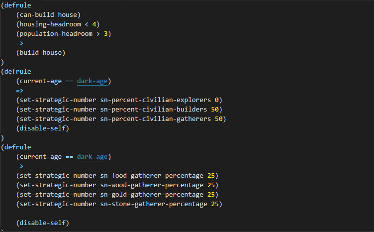
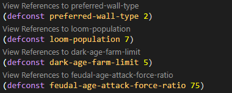

# Age of Empires II AI Tools for Visual Studio (VSCode Edition)
[](https://greenkeeper.io/)

<!-- TOC depthFrom:3 -->

- [Age of Empires II AI Tools for Visual Studio (VSCode Edition)](#age-of-empires-ii-ai-tools-for-visual-studio-vscode-edition)
  - [Legend](#legend)
  - [1. Overview](#1-overview)
  - [2. Features](#2-features)
    - [2.1 Rule Counter](#21-rule-counter)
    - [2.2 Syntax Highlighting](#22-syntax-highlighting)
    - [2.3 Linting](#23-linting)
    - [2.4 Snippets](#24-snippets)
    - [2.5 Signature Help](#25-signature-help)
    - [2.6 Constant (Symbol) Detection](#26-constant-symbol-detection)
    - [2.7 Codelens support](#27-codelens-support)
    - [2.8 Hover Support](#28-hover-support)
    - [2.9 AI Inspector](#29-ai-inspector)
    - [2.10 References Support](#210-references-support)
  - [3. Requirements](#3-requirements)
  - [4. Extension Settings](#4-extension-settings)
  - [5. Known Issues](#5-known-issues)
  - [6. Release Notes](#6-release-notes)
  - [7. Credits](#7-credits)
  - [NOTES](#notes)

<!-- /TOC -->


## Legend
 
 | Term/Phrase | Definiton/Usage |
 |-------------| --------------- |
 | AoE II AI Tools | This extension  |
 | Age of Kings or later | Any version of AoE II made in 1999 or later|
 | by the books |done or made with special research drawn from the CPSB guide|
 | CPSB guide   | Computer Player Strategy Builder guide, used for R&D in conjunction with this extension |


## 1. Overview 

Age of Empires was one of those hit games from the late 90s/ early 2000s that had a neat AI system. We considered the fact that its expert system could possibly be a scripting language. In that case, KnightThyme Tools decided to make a VS Code extension that would bring joy to AoE II content creators (specifically AI makers) anywhere. If you are reading this, then you have installed that extension.


## 2. Features
 

### 2.1 Rule Counter
 
 The rule counter is a neat visual on the right side of your status bar in which will display the number of rules (indicated by an opening parenthesis followed by "defrule") in your AI script.


### 2.2 Syntax Highlighting

AoE II AI Tools not only contains a rule counter, but it also contains syntax highlighting support as well. As of right now, it is still being worked on. However, it does recognize key tokens such as ```defrule```, ```defconst```, ```disable-self```, and the "arrow", or ```=>```. Syntax is highlighted and colored using the ```Dark Age``` theme (included with this extension).



### 2.3 Linting

As questionable as it seems, there is linting support in AoE II AI Tools. However, it's still incomplete. The good thing is that it does work. The linter was crafted by the books when it comes to diagnostics, so the error codes and other info in Problems are **the exact same** as what you would see **in-game** (if you played the AI without fixing the issues first). The following error types are available in AoE II AI Tools:

| Name   | Message | Explanation |
| ------ | ------- | ----------- |
|ERR8001 | No rules| Every ```.per``` file needs at least one rule. If you see this error, you have no rules defined.|
|ERR6002 | Rule too long | Rules can only hold up to 16 lines of actual code each. If you have too many facts or actions, see if you can remove the unneccessary ones first.
|ERR2011 | Missing closing parenthesis|  When doing parenthesis-based programming (like seen in Lisp and Racket), **ALWAYS** ensure you close anything with an opening parenthesis (i.e ```(```) before moving on to the next step. This error has two variants; One occurs when you forget to close a rule, the other happens for everything else.|
|ERR2001 | Missing opening parenthesis | This is similar to ERR2011, but has one major difference: it's the **exact opposite** of ERR2011. This error is rarely used given that every command, fact and action starts with an opening parenthesis.|
|ERR2002 | Missing keyword | This error is somewhat ambiguous given the uses in the language. One meaning of this could be that you are missing important parameters. Another could be that you are missing the token that starts it all (the name of a fact or action).It depends.|
|ERR2012 | Constant already defined | This error tells you that you have redefined a constant (set a different value to it after declaring it in a previous line). To fix, all you have to do is just remove the line with this error. This error also shows the name of the constant being misused|
|ERR2008 | Missing arrow | This error tells you that a rule is missing the token than separates facts and actions in that rule: the arrow, or ```=>```. To fix it, go to the line where the rule starts, and add an arrow after the last fact (condition) in the rule.|

More errors will be added here in the future.

### 2.4 Snippets

Snippets were introduced into AoE II AI Tools early on in development, but weren't the focus of the extension until after its alpha release. To improve other features and to help future AI developers, more snippets will be added in the future. As of right now, there are only 4 snippets: ```Add Constant```, ```Add Rule```, ```Add Rule (Gameplay Actions)``` and ```Add Rule (Escrowed Gameplay Actions)```. 

### 2.5 Signature Help

AoE II AI Tools does have signature help, and the funny thing is that it's stable (yes, it works pretty good). This feature   has been tuned over a period of 7 months to ensure that it works properly due to issues that would sometimes pop up in the past with it. An interesting quirk of the signature help feature in AoE II AI Tools is that it can work with Intellisense (specifically, code completion) to give users the **correct** options for the active parameter (the text highlighted in bold at the top in parentheses). However, that part of this is technically the only part of this feature that is experimental.

### 2.6 Constant (Symbol) Detection

There is support for Symbols in AoE II AI Tools. However, it only works in Workspace mode, so it shows *every symbol* in the current directory. The symbols, however, aren't the ones you expect. They are constants, or variables that **cannot** be changed. You can use the Command Palette to find each symbol. Also, upcoming is a feature for finding references to constants or other ```.per``` files used in the current document.

### 2.7 Codelens support

This feature is present and functional yet. Codelens has been implemented as of February 22nd, 2019. It only shows Codelens results for constants, however.




 More information will be provided here every update.

### 2.8 Hover Support

There is hover support in AoE II AI Tools. However, some fields and content is missing as it only shows you the syntax and parameters.

### 2.9 AI Inspector

The AI Inspector is a special tree-view panel that is automatically added to VSCode when AoE II AI Tools is installed. It's prime function is to show the user information about certain parts of the AI such as constants, files (if loaded), and rules. However, only **one** works as of right now (Constants). That section of the inspector shows you each constant's name and it's value (an integer from -32768 to 32768) in rows. More updates will ensure all sections are covered by May 2019.

### 2.10 References Support

There is support for finding references in ```.per``` files implemented in AoE II AI Tools. However it is barebones. That means it only supports constants as of right now. There will be support for goals (goals and their constants) in the future, but it will require more information on how the goals should be identified within the script and represented.


## 3. Requirements

The only clear dependency (for testing) is Age of Empires II (Age of Kings or later). If you want to work with UserPatch (UP) you will need one of the following:

1. The Conquerors 1.5 (from UserPatch)
2. The Conquerors 1.0c (same as above)
3. Age of Empires II HD (available on Steam, check storefront for price, also comes with UserPatch)


## 4. Extension Settings

This extension contributes the following settings:

* `aoe2ai.ruleCounterEnabled`: enable/disable the rule counter on the bottom to see the rule count.

* `aoe2ai.codelensSupportEnabled`: enable/disable Codelens for AoE II AI tools (will have a filter setting in the future to accompany this).

## 5. Known Issues

All issues from the past release have been resolved. However, more will be covered in this section as issues are seen and noted.

 If you find an issue, report it.

## 6. Release Notes

Currently in dev.


-----------------------------------------------------------------------------------------------------------
## 7. Credits

* Icons made by [Freepik](http://www.freepik.com) from [Flaticon](https://www.flaticon.com/) is licensed by [CC 3.0 BY](http://creativecommons.org/licenses/by/3.0/).

**Enjoy!**


## NOTES

1. This extension was created in June 2018, but was never released to the public until February 17th, 2019 due to concerns over quality.
